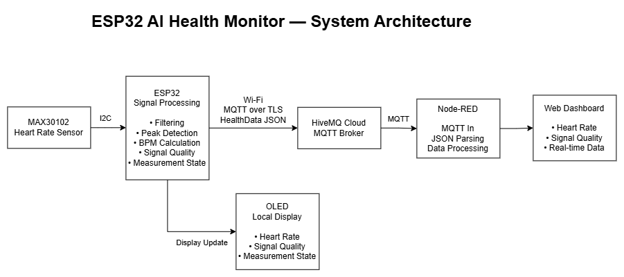

# ESP32 AI Health Monitor

A lightweight IoT-based health monitoring system built with ESP32 and MAX30102.

The system acquires heart-rate data from the MAX30102 sensor, performs real-time signal processing on the ESP32, displays measurement results locally on an OLED, and publishes structured health data to a cloud MQTT broker for real-time visualization through Node-RED.

## System Architecture



The system follows the data flow:

MAX30102 → ESP32 → HiveMQ Cloud → Node-RED → Web Dashboard

The ESP32 also provides a local OLED display for immediate feedback.

## Key Features

- Real-time heart-rate acquisition using MAX30102
- Signal filtering and peak detection on ESP32
- BPM calculation
- Signal quality classification
- Measurement state management
- Local OLED display
- Wi-Fi connectivity
- MQTT over TLS communication
- Structured HealthData JSON publishing
- Node-RED data processing
- Real-time web dashboard

## Hardware

- ESP32 DevKit
- MAX30102 Heart Rate Sensor
- SSD1306 OLED Display

## Software Architecture

The firmware is organized into modular components:

- **Sensor** — MAX30102 initialization and data acquisition
- **Algorithm** — Signal filtering, peak detection, BPM calculation, and signal quality analysis
- **HealthData** — Shared health measurement data structure
- **Display** — OLED rendering and local status display
- **Network** — Wi-Fi and MQTT communication
- **Config** — Hardware and system configuration

The project separates data acquisition, signal processing, display, and communication responsibilities to improve maintainability and extensibility.

## Signal Processing

The ESP32 processes the raw sensor signal locally before publishing the result.

Current processing includes:

- Moving-average filtering
- Peak detection
- BPM calculation
- Signal quality classification
- Measurement state detection

The system distinguishes between different measurement conditions such as no finger, signal movement, and good-quality measurements.

## IoT Communication

Health data is published from the ESP32 to HiveMQ Cloud using MQTT over TLS.

Example data structure:

```json
{
  "heartRate": 72,
  "spo2": 0,
  > Note: SpO₂ is currently reserved in the data structure and is planned for future implementation.
  "signalQuality": "GOOD",
  "measureState": "DATA_READY",
  "timestamp": 123456
}
```

The structured data is then received and processed by Node-RED before being displayed on the web dashboard.

## Node-RED Dashboard

Node-RED is used as the IoT data processing and visualization layer.

The dashboard currently provides:

- Heart Rate
- Signal Quality
- Real-time measurement data

## Project Structure

```text
AI_Health_Monitor/
├── include/
│   ├── algorithm/
│   ├── common/
│   ├── config/
│   ├── display/
│   ├── network/
│   └── sensor/
│
├── src/
│   ├── algorithm/
│   ├── display/
│   ├── health/
│   ├── network/
│   ├── sensor/
│   ├── system/
│   └── main.cpp
│
├── docs/
│   ├── 01_Data_Architecture.md
│   ├── 02_Sensor_Module_Design.md
│   ├── architecture.drawio
│   └── architecture.png
│
├── platformio.ini
└── README.md
```

## Documentation

Additional technical documentation is available in the `docs/` directory:

- [Data Architecture](docs/01_Data_Architecture.md)
- [Sensor Module Design](docs/02_Sensor_Module_Design.md)

The editable system architecture source is also provided as `architecture.drawio`.

## Current Status

### MVP Completed

- MAX30102 sensor acquisition
- Heart-rate signal processing
- BPM calculation
- Signal quality classification
- Measurement state management
- OLED local display
- Wi-Fi connection
- MQTT over TLS
- HiveMQ Cloud integration
- Node-RED data processing
- Web dashboard

### Future Improvements

- SpO₂ algorithm implementation
- Heart-rate history and data logging
- Improved signal quality and motion detection
- OTA firmware update
- Long-term cloud data storage
- Additional health metrics

## Development

Built with:

- C++
- ESP32
- PlatformIO
- MQTT
- HiveMQ Cloud
- Node-RED
- FreeRTOS